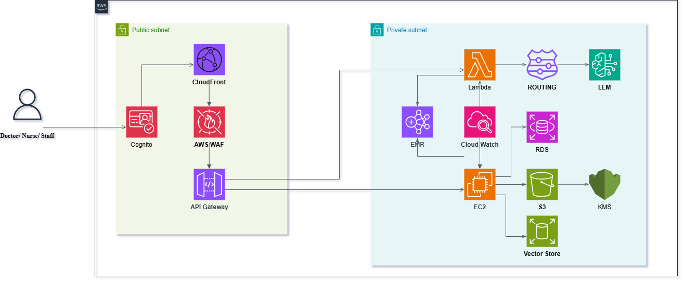

## Em tạo nhầm tên repo nhóm

--------------
Team3 - Zone 3 - E403

Hospital Clinical Support Assistant (Scenario 2)

Xây dựng trợ lý AI tích hợp trong bệnh viện nhằm giảm tải áp lực hành chính và hỗ trợ ra quyết định lâm sàng nhanh chóng.
---

## 👥 Danh Sách Thành Viên (Team Members)

| Họ và Tên | Mã Số Sinh Viên |
| :--- | :---: |
| **Nguyễn Trí Cao** | 2A202600223 | 
| **Đậu Văn Nam** | 2A202600033 | 
| **Cao Diệu Ly** | 2A202600356 |
| **Lê Minh Tuấn** | 2A202600379 |

---

## WorkSheet


### Architecture



1. **Clone dự án:**
   ```bash
   git clone [https://github.com/username/project-name.git](https://github.com/username/project-name.git)
